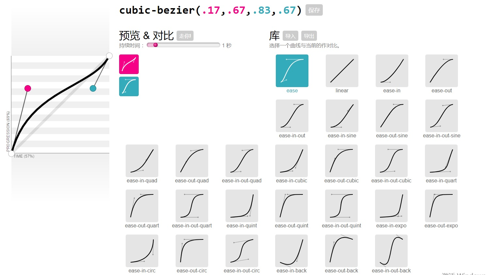
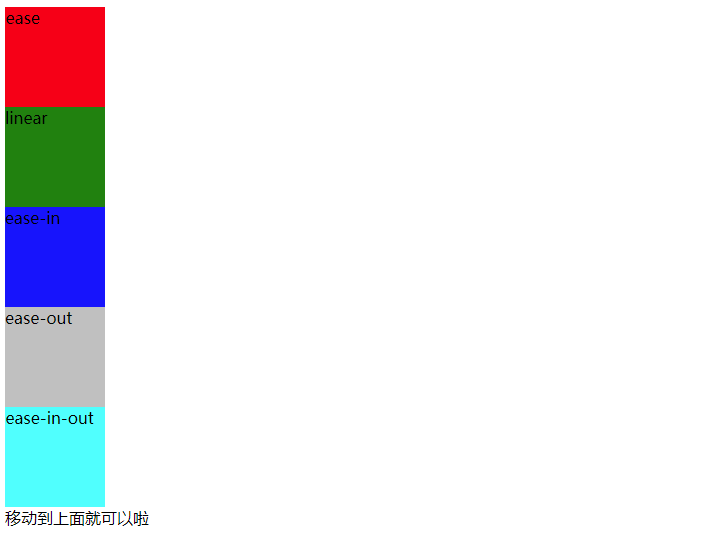

## Transition属性：


| 属性 | 描述 | CSS |
| ------ | ------ | ------ |
| [transition](http://www.w3school.com.cn/cssref/pr_transition.asp) | 简写属性，用于在一个属性中设置四个过渡属性。 | 3 |
| [transition-property](http://www.w3school.com.cn/cssref/pr_transition-property.asp) | 规定应用过渡的 CSS 属性的名称。默认值all。 | 3 |
| [transition-duration](http://www.w3school.com.cn/cssref/pr_transition-duration.asp) | 定义过渡效果花费的时间。默认是 0。 | 3 |
| [transition-timing-function](http://www.w3school.com.cn/cssref/pr_transition-timing-function.asp) | 规定过渡效果的时间曲线。默认是 ease。 | 3 |
| [transition-delay](http://www.w3school.com.cn/cssref/pr_transition-delay.asp)| 规定过渡效果何时开始。默认是 0 | 3 |


额外提一下两个属性：

* transition-property   
 all: 所有属性， none: 也就是不生效。  
 当然也不是所有的属性都可以来动效， 具体的参考[Certain CSS properties can be animated ](https://developer.mozilla.org/en-US/docs/Web/CSS/CSS_animated_properties)  
 不支持的动画属性：background-image,  float,  display,  position,visibility。

  [深入理解CSS过渡transition](https://www.cnblogs.com/xiaohuochai/p/5347930.html)有一个简单分类的总结，当然相对全面还是[Certain CSS properties can be animated ](https://developer.mozilla.org/en-US/docs/Web/CSS/CSS_animated_properties)  

```
颜色: color background-color border-color outline-color
位置: backround-position left right top bottom
长度: 
    [1]max-height min-height max-width min-width height width
    [2]border-width margin padding outline-width outline-offset
    [3]font-size line-height text-indent vertical-align  
    [4]border-spacing letter-spacing word-spacing
数字: opacity visibility z-index font-weight zoom
组合: text-shadow transform box-shadow clip
其他: gradient
```
  


* transition-timing-function   
  三阶贝塞尔曲线函数， 这里只要两个控制点的值。  
  至于什么是贝塞尔曲线，可以看看[贝塞尔曲线扫盲](https://www.cnblogs.com/yjbjingcha/p/7350264.html)。    
  内置了几个简单的：

    1、ease：逐渐变慢, 贝塞尔曲线(0.25, 0.1, 0.25, 1.0)   
    2、linear：匀速，linear 贝塞尔曲线(0.0, 0.0, 1.0, 1.0)   
    3、ease-in：加速，ease-in 贝塞尔曲线(0.42, 0, 1.0, 1.0)   
    4、ease-out：减速，ease-out贝塞尔曲线(0, 0, 0.58, 1.0)   
    5、ease-in-out：加速然后减，ease-in-out 贝塞尔曲线(0.42, 0, 0.58, 1.0)   

  更多的可以在这里获得[在线贝塞尔](http://yisibl.github.io/cubic-bezier/)。
  

  这里的取值还有一种steps函数，可以参考[深入理解CSS过渡transition](https://www.cnblogs.com/xiaohuochai/p/5347930.html)    


--------------------

### **多值：多种属性同时变化的时候**
  依旧是两个总写法。 **注意transition-property和其他属性数量不一致的情况。**
   ```css
/* 方法一*/
.demo{
    transition-property: width, height;
    transition-delay: 500ms;
    transition-timing-function: linear;
    transition-duration: 2000ms;
}
/* 方法二*/
.demo{
  transition: width 2000ms linear 500ms, height 2000ms linear 500ms
}

```

### 触发方式

* 伪类触发   
:hover、:focus、:active等
* 媒体查询触发   
@media
* javascript触发

##  Transition事件
* [transitioncancel](https://developer.mozilla.org/en-US/docs/Web/API/HTMLElement/transitioncancel_event)  
  转换取消事件 ， 该事件和transitionend互斥，只会有一个发生。
* [transitionend](https://developer.mozilla.org/en-US/docs/Web/API/HTMLElement/transitionend_event)   
  转换结束事件
* [transitionrun](https://developer.mozilla.org/en-US/docs/Web/API/HTMLElement/transitionrun_event)  
  转换进行事件  
* [transitionstart](https://developer.mozilla.org/en-US/docs/Web/API/HTMLElement/transitionstart_event)   
  转换开始事件，**因为转换有delay属性，所以进行，不一定真正的开始。**

```js
const transition = document.querySelector('.transition');

transition.addEventListener('transitioncancel', () => {
  console.log('Transition canceled');
});
```

Transition事件的触发次数是非复合的过渡属性的个数, 比如width, height同时变换，那么就是两次。         
还比较有趣的事， 比如hover到某元素的时候，开始变换，没变换结束，你就离开。
变换效果会倒着来。下面的demo，就会看到。

## 简单的Demo

### 内置贝塞尔函数运动效果
效果有：  
* ease   
* linear
* easy-in
* easy-out
* easy-in-out   
[贝塞尔曲线运动-演示地址](../css/transition/timing-fun.html)    



### 进度条
思路  
* 两个div, 一个outer, 一个inner
* box-shadow
* transition

[进度条-演示地址](../css/transition/progress.html)   


### 雪花飘飘
思路： 
* n个postion为absolute的HTML节点
* transition 随机贝塞尔曲线和动画时间   
[雪花飘飘效果](../css/transition/snow.html)    


### 类似外卖的添加到购物车     
思路：
* transition top和left的贝塞尔曲线一个linear一个easy-in达到抛物效果   
[购物车抛物线效果](../css/transition/prod.html)   


> [CSS Transitions](https://www.w3.org/TR/css-transitions-1/)   
[Using CSS transitions](https://developer.mozilla.org/en-US/docs/Web/CSS/CSS_Transitions/Using_CSS_transitions)    
[TransitionEventSection](https://developer.mozilla.org/en-US/docs/Web/API/TransitionEvent)  
[css-transitions | Can I Use](https://caniuse.com/#feat=css-transitions)   
[深入理解CSS过渡transition](https://www.cnblogs.com/xiaohuochai/p/5347930.html)  